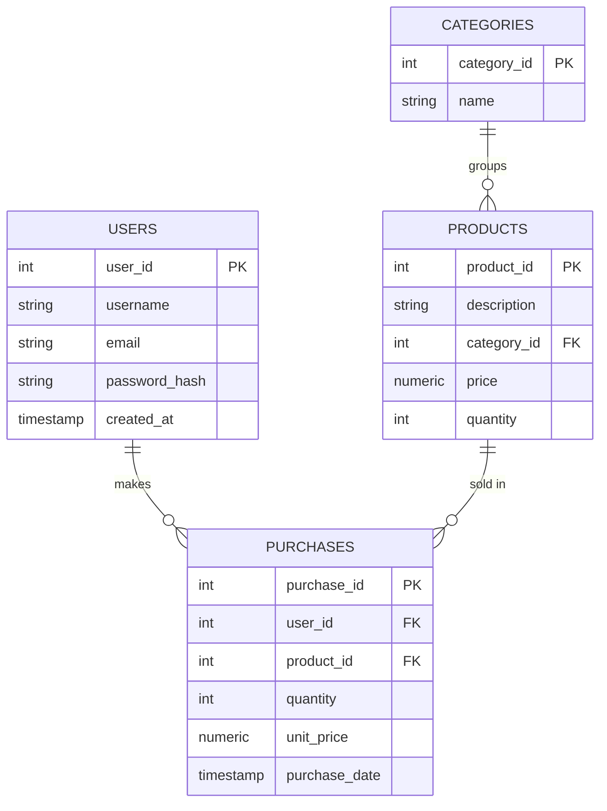

# E-Commerce SQL Database 🛒


[](https://postgresql.org/)
[](LICENSE)

A PostgreSQL database schema for a simple e-commerce platform, built as a portfolio project. Includes normalized tables, sales history tracking, and ready-to-use analytical queries — no ORM, no framework, just plain SQL.

## 🚀 Features

* Normalized schema: users, categories, products and purchases as separate tables
* Unique constraints on username and email, hashed passwords
* Purchase history table decoupled from live stock (tracks price at time of sale)
* Data integrity via foreign keys and `CHECK` constraints (no negative price/quantity)
* Indexes on the most queried columns (purchase date, product, category)
* Ready-made analytical queries: monthly revenue, best-selling products, revenue by category, top spenders
* Zero dependencies: just run the `.sql` files against PostgreSQL

## 📁 Project structure

```
ecommerce-sql-db/
├── schema.sql       # core tables: users, categories, products
├── purchases.sql     # purchases table (sales history)
├── queries.sql         # example analytical queries
├── seed.sql               # sample data to populate the database
└── README.md
```

## 🎨 Schema



## ▶️ Usage

No build tools required. Clone the repo and run the SQL files against a PostgreSQL database:

```bash
psql -U postgres -d your_database -f schema.sql
psql -U postgres -d your_database -f purchases.sql
psql -U postgres -d your_database -f seed.sql
```

Then try the example queries in `queries.sql`.

## ⚠️ Disclaimer

This is a portfolio project meant to demonstrate schema design and query writing — not a production-ready e-commerce backend.

## 👨‍💻 Author

Francesco Falone — personal project / SQL portfolio piece.

## 📄 License

This project is licensed under the MIT License — see [LICENSE](LICENSE).
